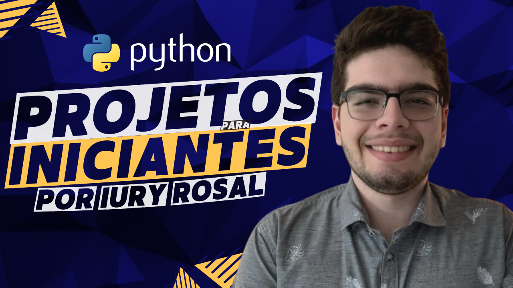

  
  <h1 align="center">Projetos em Python para Iniciantes</h1>

## 🎯 Aprenda Python praticando com exemplos e projetos

Abaixo você encontrará conteúdos para te guiar e ajudar a aprender Python, praticando por meio da construção de mini-projetos e exemplos práticos.

 <strong>Segue nas redes sociais para acompanhar mais conteúdo: </strong>  

## ⚠️ Aviso importante

> Antes de tudo você pode me ajudar, deu bastante trabalho fazer esse repositório e organizar para fazer seu estudo ou trabalho melhor, portanto você pode me ajudar das seguinte maneiras
- Me seguindo nas redes sociais
- Compartilhar o conteúdo para ajudar no alcance
- Seja apoiador via Apoia-se (e tendo benefícios em troca):
  
 

## 🥰 Apoiadores
Sem eles nada disso seria possível:

|Messias Tayllan|Aluísio Alves|Pedro Henrique|Vinicius Melo
|----|---------|-------|-------------|
|Tomás Coelho|Helena Oliveira|Michel Vasconcelos|José Vanderley
|Victor Henrique|Andrea Sampaio|Lucilaneo Santos|Laura Santiago|

Quer me apoiar nesse trabalho de produzir materiais e conteúdos, em português, para a comunidade brasileira de software e dados? Se torne apoiador via a campanha do apoia-se, com o valor simbolico mensal, além de me estimular na criação de conteúdo, irá me auxiliar nas despesas do projeto voluntário.

  
 

## 📛 Direitos autorais

> Alguns projetos desse repositório foram construídos e inspirados de fontes estrangeiras. Em cada vídeo do canal, na descrição, as fontes sempre são expostas. Mas, de modo geral, reúno todas elas aqui, em respeito ao ótimo trabalho dos seus criadores. 
- [Tech with Tim](https://www.youtube.com/c/TechWithTim) - Canal do Youtube de Tecnologia.
- [Resolução de Problemas com Algoritmos e Estruturas de Dados usando Python](https://panda.ime.usp.br/pythonds/static/pythonds_pt/index.html) - Site atrelado a instituição IME-USP

## 💡 Nossa proposta

> A proposta deste repositório é promover a aplicação de conhecimentos teóricos com projetos práticos, sendo um estímulo para fixar esses conhecimentos e ver seu uso em projetos reais. Além disso, com a realização dos projetos, o profissional já poderá ter um portfólio inicial, auxiliando na captação de oportunidades. Todos os conteúdos são originalmente em Português, pois o foco é agregar na comunidade brasileira e afins (que falam o mesmo idioma). 
## 👑 Lançando a oportunidade

> Não foque apenas em consumir os vídeos em que construo os projetos. No começo do vídeo, eu explico o escopo do que será construído. Busque construir (na sua mente ou em um papel), um esboço do desenho da solução, pode até ser em pseudocódigo. Ao longo do vídeo, você pode me seguir e ir construindo juntamente com o vídeo. Uma alternativa é, após ou antes de assistir o vídeo, construir sua própria solução, aplicando melhorias em relação ao que apresentei no vídeo. Não deixe de compartilhar sua construção e ideias (se for possível me marcar nas redes ou linkar com o canal, seria muito legal para eu visualizar e auxiliar na divulgação do trampo!)

## 🎈 Guia de Índice 
Os projetos/videos estão categorizados em leves.
> <b>😄 Level A</b>: Projetos que envolvem os primeiros passos no mundo da programação e para quem está aprendendo a linguagem Python.
#
> <b>😏 Level B</b>: Projetos desse nível já envolvem conhecimentos um pouco mais intermediários para quem está começando. Normalmente trabalhamos com alguns paradigmas de programação, como Programação Orientada a Objetos, paralelismo e concorrência.

# 
> <b>🤩 Level C</b>: Projetos mais avançados para quem está começando. Nesses projetos lidaremos com conceitos como estruturas de dados, técnicas de construção de algoritmos, Design Patterns, métodos numéricos e aplicações dos conhecimentos de Python combinando com conhecimentos de outras áreas.
 
## 📚 ÍNDICE
[😄 Level-A](#-level-a)  
[😏 Level-B](#-level-b)  
[🤩 Level-C](#-level-c)  

## 😄 Level-A
| ID | Projeto | Vídeo | Repositório |
|----|---------|-------|-------------|
| 01 | Quiz    |[][video_01]|[][repo_01]|
| 02 | Jogo de Adivinhação Numérica|[][video_02]|[][repo_02]|
| 03 | Pedra, Papel e Tesoura|[][video_03]|[][repo_03]|
| 04 | Temporizador|[][video_04]|[][repo_04]|
| 05 | Gerador de Senha|[][video_05]|[][repo_05]|
| 06 | Jogo da Adivinhação das Datas|[][video_06]|[][repo_06]|
| 07 | Validando datas com funções|[][video_07]|[][repo_07]|
| 08 | Detectando palindromos com recursividade|[][video_08]|[][repo_08]|

## 😏 Level-B
| ID | Projeto | Vídeo | Repositório |
|----|---------|-------|-------------|
| 09 | Filtrando e Mapeando Animais de um Aquário    |[][video_09]|[][repo_09]|
| 10 | Map e Reduce em Aquário|[][video_10]|[][repo_10]|
| 11 | Coletando e Exibindo Dados do NBA com API|[][video_11]|[][repo_11]|
| 12 | Conversor de Moedas Orientado a Objetos|[][video_12]|[][repo_12]|
| 13 | Conversor de Moedas Orientado a Objetos|[][video_13]|[][repo_13]|
| 14 | Portas Lógicas e Herança |[][video_13]|[][repo_13]|

## 🤩 Level-C

[video_01]:https://www.youtube.com/watch?v=MRYlWPrsMYk&list=PLshkB4NQEfC7jz8Ig-JcqwjZz8WSI2s8W
[video_02]:https://www.youtube.com/watch?v=x0_mWMQLz3E&list=PLshkB4NQEfC7jz8Ig-JcqwjZz8WSI2s8W
[video_03]:https://www.youtube.com/watch?v=kO_lUkeQm4c&list=PLshkB4NQEfC7jz8Ig-JcqwjZz8WSI2s8W
[video_04]:https://www.youtube.com/watch?v=yfAixrxCVfo&list=PLshkB4NQEfC7jz8Ig-JcqwjZz8WSI2s8W
[video_05]:https://www.youtube.com/watch?v=aAImiFpG_hA&list=PLshkB4NQEfC7jz8Ig-JcqwjZz8WSI2s8W
[video_06]:https://www.youtube.com/watch?v=ridIE7ZS5KI&list=PLshkB4NQEfC7jz8Ig-JcqwjZz8WSI2s8W
[video_07]:https://www.youtube.com/watch?v=m8xBpg0knCM&list=PLshkB4NQEfC7jz8Ig-JcqwjZz8WSI2s8W
[video_08]:https://www.youtube.com/watch?v=66ugH75ao7c&list=PLshkB4NQEfC7jz8Ig-JcqwjZz8WSI2s8W
[video_09]:https://www.youtube.com/watch?v=0PvfcHCtqXw&list=PLshkB4NQEfC7jz8Ig-JcqwjZz8WSI2s8W
[video_10]:https://www.youtube.com/watch?v=yZ2ATIGXSIQ&list=PLshkB4NQEfC7jz8Ig-JcqwjZz8WSI2s8W
[video_11]:https://www.youtube.com/watch?v=ghOaY1sd9aY&list=PLshkB4NQEfC7jz8Ig-JcqwjZz8WSI2s8W
[video_12]:https://www.youtube.com/watch?v=9BwJKlLu9Ug&list=PLshkB4NQEfC7jz8Ig-JcqwjZz8WSI2s8W
[video_13]:https://www.youtube.com/watch?v=YEvoDf2azq0&list=PLshkB4NQEfC7jz8Ig-JcqwjZz8WSI2s8W
[video_14]:https://www.youtube.com/watch?v=_iCCE_VuO4g&list=PLshkB4NQEfC7jz8Ig-JcqwjZz8WSI2s8W

[repo_01]:https://github.com/iuryrosal/projetos-python/blob/main/level-a/01
[repo_02]:https://github.com/iuryrosal/projetos-python/blob/main/level-a/02
[repo_03]:https://github.com/iuryrosal/projetos-python/blob/main/level-a/03
[repo_04]:https://github.com/iuryrosal/projetos-python/blob/main/level-a/04
[repo_05]:https://github.com/iuryrosal/projetos-python/blob/main/level-a/05
[repo_06]:https://github.com/iuryrosal/projetos-python/tree/main/level-a/06
[repo_07]:https://github.com/iuryrosal/projetos-python/tree/main/level-a/07
[repo_08]:https://github.com/iuryrosal/projetos-python/blob/main/level-a/08
[repo_09]:https://github.com/iuryrosal/projetos-python/tree/main/level-b/09
[repo_10]:https://github.com/iuryrosal/projetos-python/tree/main/level-b/10
[repo_11]:https://github.com/iuryrosal/projetos-python/blob/main/level-b/11
[repo_12]:https://github.com/iuryrosal/projetos-python/blob/main/level-b/12
[repo_13]:https://github.com/iuryrosal/projetos-python/blob/main/level-b/13
[repo_14]:https://github.com/iuryrosal/projetos-python/blob/main/level-b/14